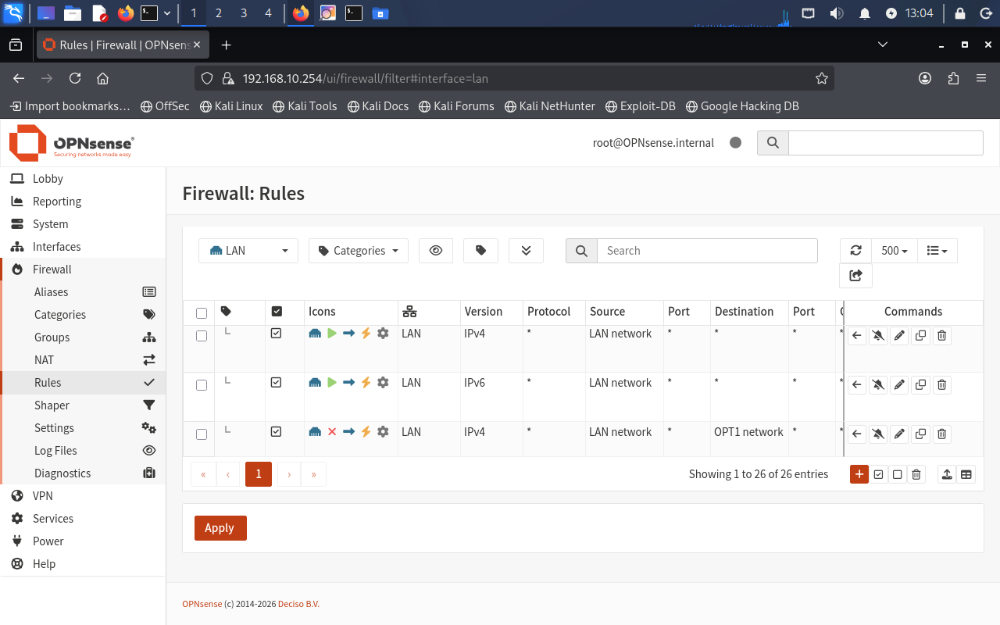
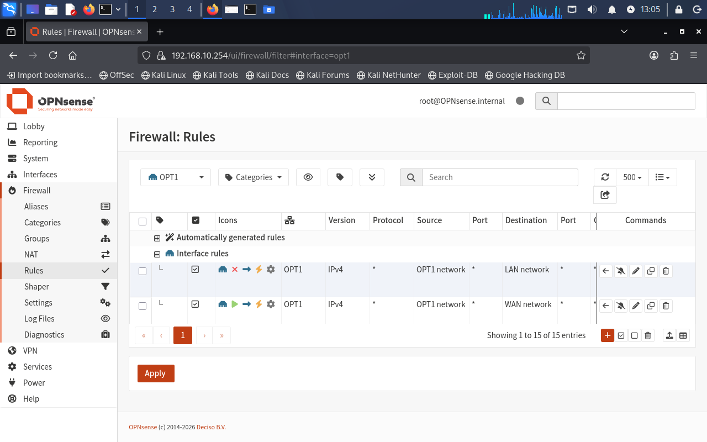
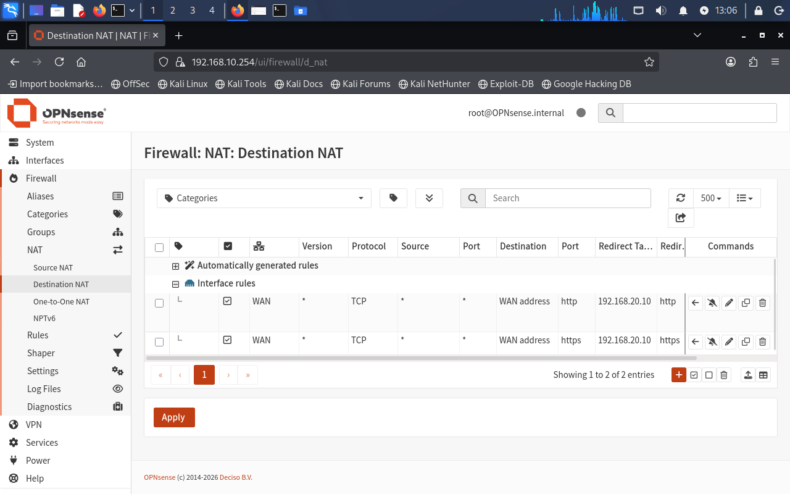
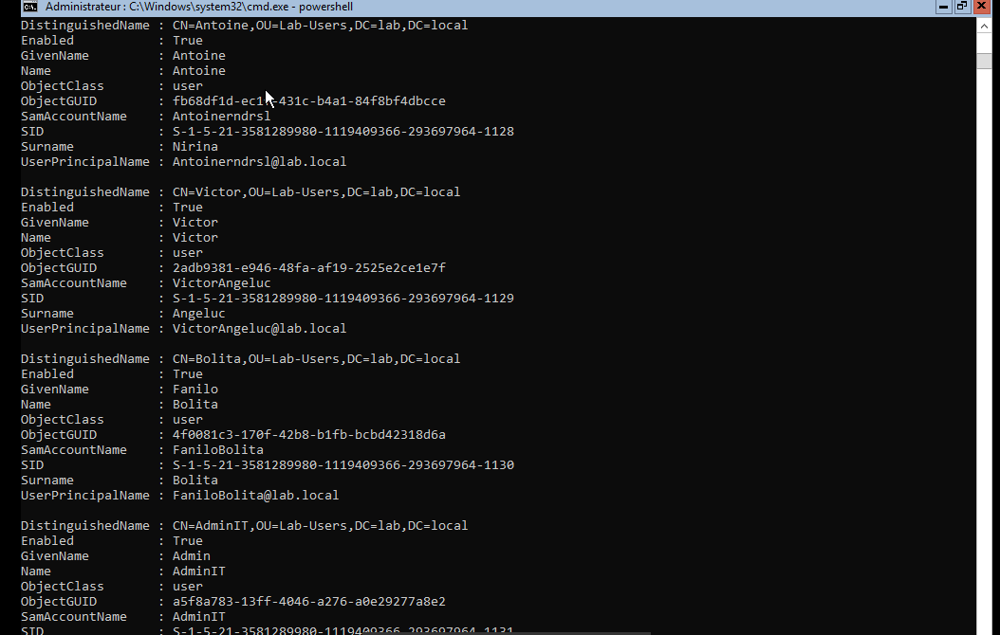
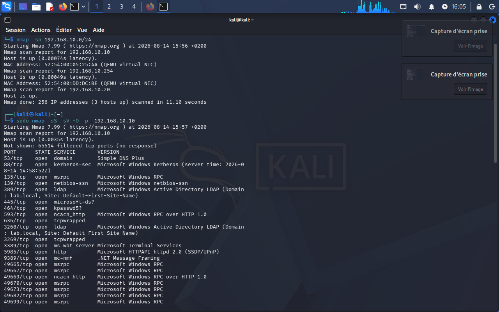
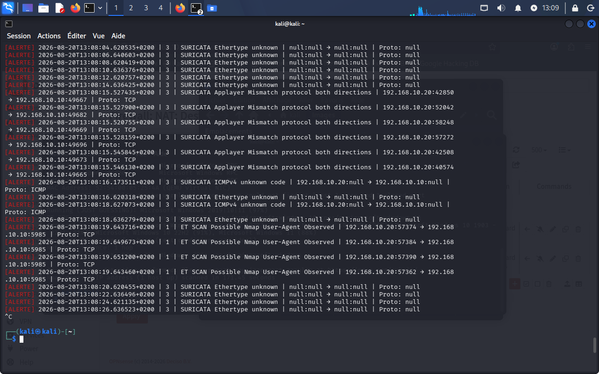
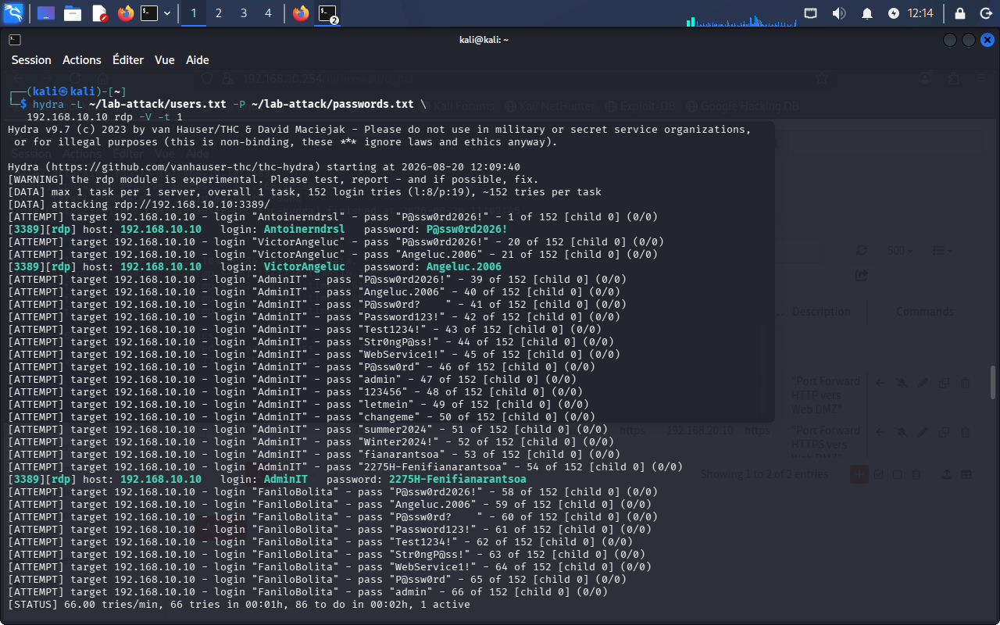
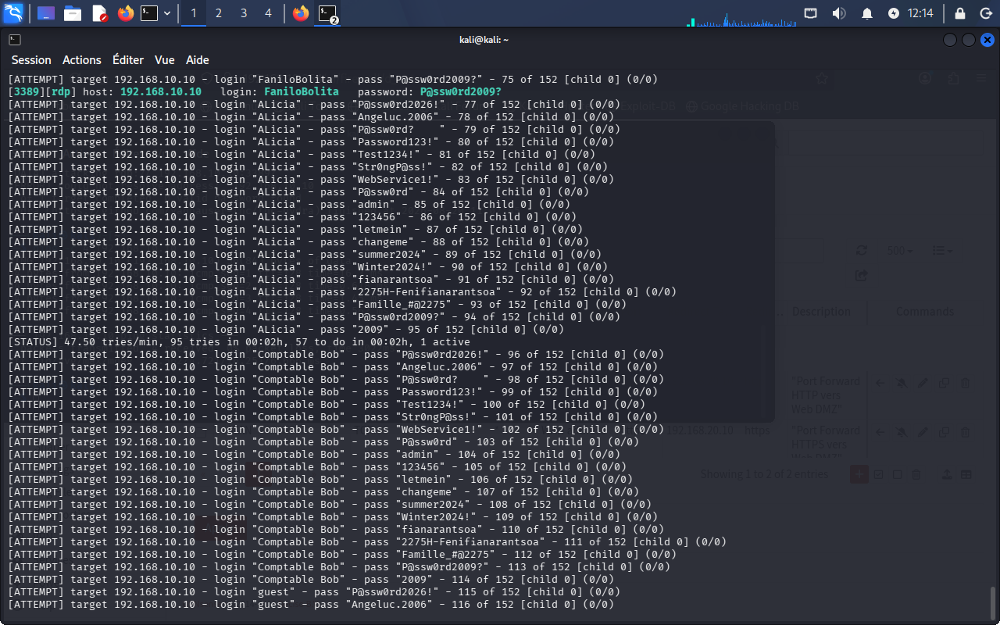

# 🔐 Secure Network Architecture — OPNsense / DMZ / Suricata IDS

> **Hands-on Cybersecurity Lab — Network Segmentation, Firewall, Active Directory, DMZ, IDS & Controlled Security Testing**

## 📌 Project Overview

This project demonstrates the design, deployment, security testing, and validation of a segmented enterprise-style network in a fully virtualized environment using **KVM/QEMU, virt-manager, and libvirt**.

The laboratory environment was designed to reproduce a small enterprise infrastructure with multiple security zones and security controls.

The architecture includes:

- **OPNsense** as the central firewall and router
- A segmented **WAN / LAN / DMZ** architecture
- **Windows Server** with Active Directory Domain Services and DNS
- **Ubuntu Server** hosting an Apache Web Server in the DMZ
- **Kali Linux** for controlled security testing
- **Suricata IDS** for network intrusion detection
- NAT and controlled Port Forwarding
- Network reconnaissance and Web security testing

The project follows a complete security workflow:

```text
Design
  ↓
Deployment
  ↓
Segmentation
  ↓
Firewall Configuration
  ↓
Security Testing
  ↓
Detection
  ↓
Analysis
  ↓
Hardening
```

> ⚠️ **Disclaimer:** All security tests presented in this repository were performed exclusively against virtual machines in an authorized and controlled laboratory environment.

---

# 🎯 Objectives

The main objectives of this project were to:

- Design a segmented enterprise-style network.
- Separate WAN, LAN, and DMZ zones.
- Deploy OPNsense as a firewall and router.
- Configure firewall rules and NAT.
- Implement controlled HTTP/HTTPS Port Forwarding.
- Deploy an Active Directory domain.
- Configure DNS on Windows Server.
- Deploy an Apache Web Server in the DMZ.
- Enable HTTPS/SSL.
- Deploy Suricata as an Intrusion Detection System.
- Perform controlled network reconnaissance using Nmap.
- Perform controlled Web security testing using Nikto.
- Perform a controlled RDP authentication security test.
- Analyze security alerts.
- Identify configuration weaknesses.
- Propose hardening measures.

---

# 🏗️ Network Architecture

The infrastructure is divided into three main security zones:

| Zone | Network | Gateway | Main Systems |
|---|---|---|---|
| WAN | `192.168.122.0/24` | DHCP | OPNsense |
| LAN | `192.168.10.0/24` | `192.168.10.254` | Windows Server, Kali Linux |
| DMZ | `192.168.20.0/24` | `192.168.20.1` | Ubuntu Server / Apache |

### Logical Architecture

```text
                         INTERNET
                             │
                             │
                    192.168.122.0/24
                             │
                     ┌───────────────┐
                     │   OPNsense    │
                     │ Firewall/NAT  │
                     └───────┬───────┘
                             │
              ┌──────────────┴──────────────┐
              │                             │
              │                             │
      LAN 192.168.10.0/24           DMZ 192.168.20.0/24
              │                             │
       ┌──────┴──────┐                ┌─────┴─────┐
       │             │                │           │
       │             │                │           │
 Windows Server   Kali Linux     Ubuntu Server
 AD DS + DNS      Security Lab   Apache + HTTPS
       │
       │
   lab.local
```

The segmentation is designed to reduce the attack surface and prevent unnecessary communication between the internal network and exposed services.

---

# 🔐 Security Policy

The network follows a **defense-in-depth** approach based on:

- Network segmentation
- Least privilege
- Default-deny filtering
- Controlled service exposure
- Firewall filtering
- NAT
- Intrusion Detection
- Security monitoring
- Hardening

### Traffic Policy

| Source | Destination | Policy |
|---|---|---|
| LAN | Internet | ✅ Allowed through NAT |
| DMZ | Internet | ✅ Allowed according to requirements |
| Internet | DMZ | ⚠️ Only published services |
| LAN | DMZ | ❌ Denied by default |
| DMZ | LAN | ❌ Denied by default |

---

# 🔥 OPNsense Firewall

**OPNsense** acts as the central firewall and routing platform.

It is responsible for:

- Routing
- Firewall filtering
- Network segmentation
- NAT
- Destination NAT
- Port Forwarding
- Traffic control
- Security logging

---

## LAN Firewall Rules

The LAN rules control traffic originating from the internal network.



The objective is to allow only the required communications and prevent unnecessary access between security zones.

---

## DMZ Firewall Rules

The DMZ is isolated from the internal LAN and has dedicated firewall policies.



This configuration helps reduce the potential impact of a compromise affecting the Web Server.

---

# 🌐 NAT & Port Forwarding

NAT is used to provide controlled Internet connectivity to internal systems.

The Web Server located in the DMZ is published using controlled Destination NAT / Port Forwarding.

The exposed services are:

```text
TCP/80   → HTTP
TCP/443  → HTTPS
```

### NAT Configuration



Only the services required for Web access are exposed externally.

The internal LAN is therefore not directly exposed to the Internet.

---

# 🏢 Active Directory

A **Windows Server** virtual machine was configured as an Active Directory Domain Controller.

### Implemented services

- Active Directory Domain Services (AD DS)
- DNS
- Domain: `lab.local`
- Test user accounts

The objective is to reproduce a centralized enterprise authentication environment.

---

## 🔑 Active Directory Authentication Test

The following screenshot provides evidence of the authentication test performed in the laboratory.


---

## 🖥️ Windows Server Result

The following screenshot shows the result obtained during the authentication test.



These screenshots provide practical evidence of the Active Directory authentication environment.

---

# 🖥️ DMZ Web Server

An **Ubuntu Server** was deployed inside the DMZ.

### Web stack

- Ubuntu Server
- Apache
- HTTP
- HTTPS / SSL

The Web Server is isolated from the internal LAN.

This architecture limits the potential impact of a compromise of the externally exposed Web service.

---

# 🛡️ Suricata IDS

**Suricata** is deployed as the Intrusion Detection System of the laboratory.

Its purpose is to monitor network traffic and detect suspicious activities using signatures and configured detection rules.

The IDS is used to observe:

- Network reconnaissance
- Port scanning
- Web scanning activity
- Suspicious network behavior
- Selected attack signatures

### Detection Workflow

```text
Security Test
      ↓
Network Traffic
      ↓
Suricata IDS
      ↓
Detection Rule
      ↓
Security Alert
      ↓
Analysis
      ↓
Hardening Recommendation
```

---

# 🔎 Network Reconnaissance — Nmap

**Nmap** was used from Kali Linux to perform controlled network discovery and service enumeration.

The purpose was to identify accessible hosts and services and validate the effectiveness of the network segmentation and filtering.

## Nmap Test from Kali Linux



The scan provides visibility into the services exposed to the testing machine.

---

# 🚨 Nmap Detection with Suricata

The network traffic generated by the Nmap reconnaissance was monitored by Suricata.



This provides evidence that Suricata can detect certain reconnaissance activities generated during the controlled test.

The validation process was:

```text
Nmap Scan
    ↓
Network Traffic
    ↓
Suricata
    ↓
Detection
    ↓
Alert
    ↓
Analysis
```

---

# 🔍 Windows Server Security Assessment

A controlled Nmap scan was performed against the Windows Server environment to identify accessible services and potential exposure.


The purpose of this assessment was to identify services that may require additional restriction or hardening.

---

# 🌐 Web Security Testing — Nikto

**Nikto** was used to perform a controlled security assessment of the Apache Web Server located in the DMZ.

The objective was to identify potential Web Server configuration issues and security weaknesses.

## Web Security Scan


The results provide information that can be used to improve the security configuration of the Web Server.

---

# 🛡️ Nikto Detection with Suricata

The network activity generated during the Web security assessment was monitored by Suricata.


This test demonstrates the relationship between offensive security testing and defensive monitoring.

The objective is not simply to execute a scanner, but to verify whether the generated network activity can be observed and detected by the IDS.

---

# 🔐 Controlled RDP Security Test

A controlled RDP authentication security test was performed against the Windows Server laboratory environment.

The purpose was to evaluate the resistance of the authentication configuration against repeated login attempts.

> ⚠️ This test was performed exclusively against the authorized Windows Server virtual machine.

## Test — Step 1



## Test — Step 2



### Observation

The test identified a weakness related to the authentication configuration.

The use of simple passwords and insufficient account protection mechanisms can increase the risk associated with repeated authentication attempts.

This finding leads to several hardening recommendations:

- Strong password policy
- Account lockout policy
- Restricted RDP access
- Network Level Authentication (NLA)
- Multi-factor authentication where applicable

---

# 📊 Security Assessment Results

| Security Control | Result | Assessment |
|---|---|---|
| LAN / DMZ Segmentation | ✅ PASS | Inter-zone traffic is controlled |
| Firewall Rules | ✅ PASS | Traffic is filtered according to defined policies |
| NAT | ✅ PASS | Internal Internet access is functional |
| HTTP/HTTPS Port Forwarding | ✅ PASS | Web services are selectively exposed |
| Active Directory | ✅ PASS | Domain and authentication environment implemented |
| DNS | ✅ PASS | Internal name resolution implemented |
| DMZ Web Server | ✅ PASS | Apache deployed in isolated DMZ |
| Nmap Detection | ✅ PASS | Reconnaissance activity detected |
| Web Security Testing | ✅ PASS | Web activity monitored by Suricata |
| RDP Security | ⚠️ WEAK | Authentication controls require hardening |
| HTTP Security Headers | ⚠️ NEEDS IMPROVEMENT | Additional security headers recommended |

---

# ⚠️ Identified Weaknesses

The security assessment identified several areas requiring improvement.

## 1. Password Policy

Weak passwords reduce resistance against password-guessing attacks.

### Recommendation

Implement:

- Strong password requirements
- Minimum password length
- Password complexity
- Password history
- Appropriate password policies

---

## 2. Account Lockout

Repeated authentication attempts should be controlled.

### Recommendation

Implement an appropriate account lockout policy to limit repeated failed authentication attempts.

---

## 3. RDP Exposure

RDP should not be unnecessarily exposed to untrusted networks.

### Recommendation

- Restrict RDP access by source IP.
- Enable Network Level Authentication.
- Use VPN or a secure administrative access path.
- Apply strong authentication controls.
- Disable RDP when it is not required.

---

## 4. HTTP Security Headers

The Web Server can be strengthened using additional security headers.

Examples include:

```text
Content-Security-Policy
Strict-Transport-Security
X-Content-Type-Options
```

These mechanisms can improve the security posture of the Web Server.

---

## 5. SSL/TLS Configuration

For a production environment, HTTPS should use a valid certificate with the correct DNS names / SAN configuration.

The current environment is intended for security learning and validation rather than production deployment.

---

# 🔧 Hardening Recommendations

## Windows Server / Active Directory

- Enforce strong password policies.
- Configure account lockout policies.
- Restrict administrative privileges.
- Disable unused accounts.
- Enable Network Level Authentication for RDP.
- Restrict RDP access by source.
- Apply the principle of least privilege.
- Implement MFA where possible.
- Keep Windows Server fully patched.

## Web Server

- Force HTTPS where appropriate.
- Use a valid TLS certificate.
- Configure security headers.
- Disable unnecessary Apache modules.
- Remove unnecessary services.
- Keep Ubuntu and Apache updated.
- Minimize information disclosure.

## Firewall / Network

- Maintain a default-deny security model.
- Restrict LAN ↔ DMZ communication.
- Allow only required ports.
- Restrict administrative services.
- Review firewall rules regularly.
- Monitor firewall logs.

## Monitoring

A future improvement would be to centralize logs from:

```text
OPNsense
    +
Suricata
    +
Windows Event Logs
    +
Apache Logs
        ↓
      SIEM
        ↓
 Log Correlation
        ↓
Security Monitoring
```

---

# 🧪 Testing Methodology

The laboratory follows a simplified security assessment lifecycle:

```text
1. Architecture Design
          ↓
2. Virtual Infrastructure Deployment
          ↓
3. Network Segmentation
          ↓
4. Firewall Configuration
          ↓
5. Service Deployment
          ↓
6. Security Testing
          ↓
7. IDS Monitoring
          ↓
8. Alert Analysis
          ↓
9. Weakness Identification
          ↓
10. Hardening Recommendations
```

This methodology demonstrates that the project goes beyond simply installing security tools.

It covers the complete process:

**Design → Deploy → Test → Detect → Analyze → Harden**

---

# 🧠 Skills Demonstrated

## Networking

- IPv4 addressing
- Subnetting
- Routing
- NAT
- Destination NAT
- Port Forwarding
- Firewall Rules
- LAN / WAN / DMZ
- Network Segmentation
- Traffic Filtering

## System Administration

- Windows Server
- Active Directory
- DNS
- Ubuntu Server
- Apache
- SSL/TLS
- Service Configuration

## Defensive Security

- Firewall configuration
- IDS deployment
- Suricata
- Security monitoring
- Alert analysis
- Network segmentation
- Hardening
- Access control
- Defense in Depth

## Offensive Security

- Network reconnaissance
- Nmap
- Service enumeration
- Web security testing
- Nikto
- Controlled authentication testing

## Virtualization

- KVM
- QEMU
- virt-manager
- libvirt
- Virtual networking
- Virtual machine deployment

---

# 🛠️ Technology Stack

| Category | Technology |
|---|---|
| Virtualization | KVM / QEMU |
| VM Management | virt-manager |
| Virtual Networking | libvirt |
| Firewall / Router | OPNsense |
| IDS | Suricata |
| Directory Services | Active Directory |
| DNS | Windows Server DNS |
| Web Server | Apache |
| Server OS | Ubuntu Server |
| Security Testing | Kali Linux |
| Network Scanner | Nmap |
| Web Security Scanner | Nikto |

---

# 📸 Evidence & Validation

The following screenshots document the practical implementation and validation of the laboratory.

## Firewall & Network Segmentation

### LAN Firewall Rules


### DMZ Firewall Rules


### NAT Configuration


---

## Active Directory

### Authentication Test


### Windows Server Result


---

## Network Security Testing

### Nmap Test


### Windows Server Security Assessment


### Nmap Detection by Suricata


---

## Web Security Testing

### Nikto Web Scan


### Nikto Detection by Suricata


---

## RDP Security Testing

### RDP Test — Step 1


### RDP Test — Step 2


---

# 📈 Security Validation Summary

The laboratory demonstrates the interaction between **preventive controls, network segmentation, offensive security testing, and defensive monitoring**.

```text
                    SECURITY ARCHITECTURE

                         OPNsense
                            │
              ┌─────────────┴─────────────┐
              │                           │
             LAN                         DMZ
              │                           │
      Active Directory              Web Server
              │                           │
              └─────────────┬─────────────┘
                            │
                       Suricata IDS
                            │
                            ↓
                   Security Monitoring
                            │
                            ↓
                     Attack Detection
```

The tests demonstrate that security controls must work together.

Network segmentation limits exposure, firewall rules control traffic, and Suricata provides an additional detection layer.

---

# 🛡️ Defense in Depth

The security architecture follows a layered security model:

```text
                 ┌──────────────────┐
                 │ Network Design   │
                 └────────┬─────────┘
                          ↓
                 ┌──────────────────┐
                 │ Segmentation     │
                 └────────┬─────────┘
                          ↓
                 ┌──────────────────┐
                 │ Firewall / NAT   │
                 └────────┬─────────┘
                          ↓
                 ┌──────────────────┐
                 │ Access Control   │
                 └────────┬─────────┘
                          ↓
                 ┌──────────────────┐
                 │ Suricata IDS     │
                 └────────┬─────────┘
                          ↓
                 ┌──────────────────┐
                 │ Monitoring       │
                 └────────┬─────────┘
                          ↓
                 ┌──────────────────┐
                 │ Hardening        │
                 └──────────────────┘
```

This layered approach is commonly referred to as **Defense in Depth**.

---

# 🚀 Future Improvements

Possible future developments include:

- Deploying a centralized SIEM such as Wazuh.
- Centralizing OPNsense, Suricata, Windows and Apache logs.
- Adding VLAN-based segmentation.
- Implementing MFA.
- Hardening Active Directory with additional Group Policies.
- Creating a dedicated management network.
- Implementing vulnerability management.
- Improving Web Server security headers.
- Creating additional Suricata detection rules.
- Implementing automated security monitoring.
- Expanding the Blue Team detection capabilities.

---

# ⚠️ Laboratory Limitations

This project is an educational cybersecurity laboratory and should not be considered a production-ready enterprise architecture.

A production environment would require additional controls such as:

- High-availability firewalls
- VLAN-based segmentation
- Centralized SIEM
- Endpoint Detection and Response (EDR)
- Multi-factor authentication
- Internal PKI
- Centralized log management
- Vulnerability management
- Network monitoring
- Backup infrastructure
- Administrative bastion host
- Incident response procedures

---

# 🏁 Conclusion

This project demonstrates the practical implementation and validation of a segmented network security architecture using:

**OPNsense + Active Directory + Ubuntu Server + Apache + Kali Linux + Suricata**

The laboratory validates several important cybersecurity principles:

- Network segmentation
- Firewall filtering
- Least privilege
- Default-deny policies
- Controlled service exposure
- Intrusion Detection
- Security monitoring
- Controlled security testing
- Security hardening

The project follows a complete security lifecycle:

```text
DESIGN
  ↓
DEPLOY
  ↓
SEGMENT
  ↓
PROTECT
  ↓
TEST
  ↓
DETECT
  ↓
ANALYZE
  ↓
HARDEN
```

The main lesson demonstrated by this laboratory is that effective cybersecurity requires multiple complementary security layers.

```text
Segmentation
      +
Firewall
      +
Access Control
      +
IDS
      +
Monitoring
      +
Hardening
      =
Defense in Depth
```

This project provides practical evidence of skills in:

**Network Security · Firewall Administration · System Administration · Virtualization · Active Directory · IDS · Security Testing · Network Segmentation · Security Hardening**

---

## 📚 Project Information

| Item | Details |
|---|---|
| Project Type | Cybersecurity Home Lab |
| Architecture | WAN / LAN / DMZ |
| Virtualization | KVM / QEMU |
| Firewall | OPNsense |
| IDS | Suricata |
| Directory Services | Active Directory |
| Web Server | Apache |
| Testing Platform | Kali Linux |
| Network Testing | Nmap |
| Web Testing | Nikto |
| Security Approach | Defense in Depth |
| Environment | Authorized Virtual Laboratory |

> **All security testing was performed in an isolated and authorized laboratory environment for educational and security validation purposes.**
